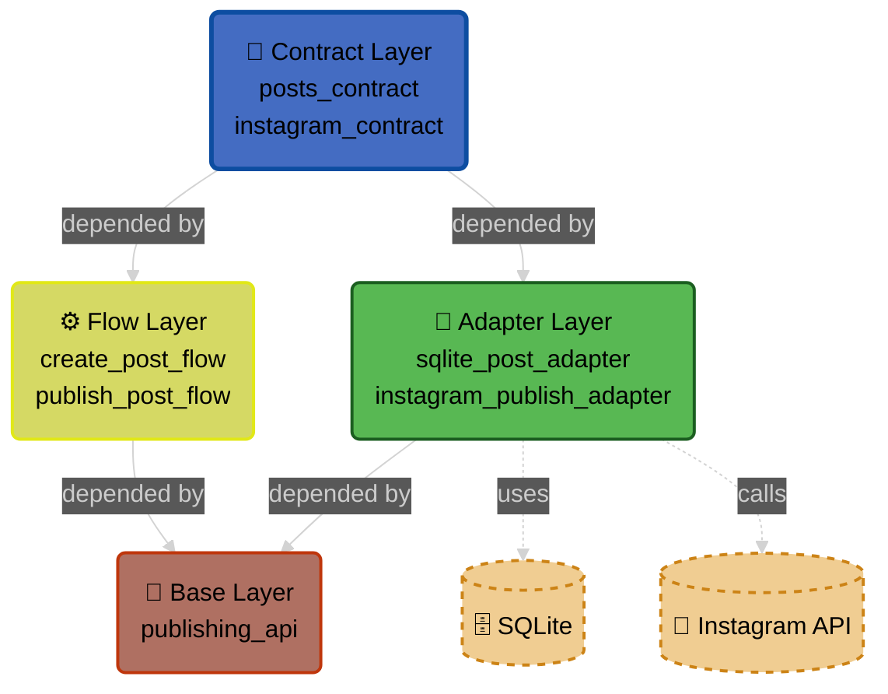
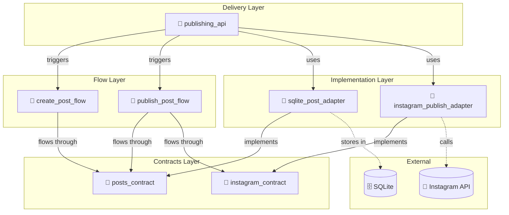

# PolyClean Architecture Proposal

_A Polylith-inspired, Clean Architecture–influenced approach for structured Python systems._

PolyClean is a structured architectural approach built on two ideas:

- **Polylith** for modular workspace structure
- **Clean Architecture** for inward-facing dependency rules

This document is:

- A teaching guide
- A concrete worked example
- A proposal for team discussion

It is intentionally opinionated, but not yet a rigid standard.

---

## Why PolyClean?

As systems grow, two problems tend to appear:

1. Business logic becomes tangled with infrastructure.
2. Dependencies become unclear and fragile.

PolyClean addresses this by introducing:

- Clear directional dependencies
- Explicit layer responsibilities
- Strict separation between business logic and technical implementation

The goals are:

- Predictable structure
- Replaceable infrastructure
- Testable business logic
- Clear onboarding for new developers
- Clear reasoning boundaries for both humans and AI systems

---

## Designing for Human and AI Comprehension

Modern projects are no longer read only by humans.

They are increasingly read, modified, and reasoned about by:

- AI coding assistants
- Static analysis tools
- Automated refactoring systems

As systems grow, cognitive load becomes the main constraint.

PolyClean intentionally structures projects so they can be understood in **digestible chunks**.

### Chunking by Responsibility

Each brick represents a single, clear responsibility:

- A contract defines concepts and rules.
- A flow defines a single business process.
- An adapter defines one technical integration.
- A base defines one delivery entry point.

This allows a reader (human or AI) to:

1. Open a single flow brick.
2. Follow its imports to the contracts it depends on.
3. Understand the full behaviour of that use case without reading unrelated infrastructure.

### Following the Path of Execution

In PolyClean, the execution path of a request is explicit:

Base -> Flow -> Contract

If persistence or integration is required:

Flow -> Contract -> Adapter (implementation chosen by Base)

This means that to understand a feature, you typically only need to read:

- The relevant base brick
- The specific flow brick
- The contracts referenced by that flow

You do **not** need to read:

- Other flows
- Other adapters
- Unrelated parts of the system

### Scaling Clarity as the System Expands

As more features are added:

- New flows are added as separate bricks.
- New adapters are added without modifying existing flows.
- Contracts evolve in controlled, explicit ways.

This prevents the "everything is connected to everything" problem.

Each feature remains locally understandable.

This locality of reasoning is what makes the system:

- Maintainable for humans
- Navigable for new team members
- Safer for AI-assisted modification

PolyClean is therefore not only about architectural purity —

It is about preserving **comprehensibility at scale**.

---

## The Core Model

PolyClean organises code into four layers:

1. **Contract**
2. **Flow**
3. **Adapter**
4. **Base**

Each layer has a single responsibility.

Dependencies always point inward:

```text
Base -> Flow -> Contract
Adapter -> Contract
```

Contracts sit at the centre.

---

## Diagrams

### Layer Dependency Overview



---

## Layer Overview

| Layer    | Purpose                                 | Contains                        | May Depend On             |
| -------- | --------------------------------------- | ------------------------------- | ------------------------- |
| Contract | Define what exists and what services do | Entities, Protocols, Invariants | Python stdlib only        |
| Flow     | Orchestrate business processes          | Workflows, decision logic       | Contracts only            |
| Adapter  | Implement technical details             | DB, HTTP, external integrations | Contracts + external libs |
| Base     | Composition root                        | Wiring, DI, framework setup     | Everything                |

---

## Running Example: Posting to Instagram

We will use a simple example throughout:

- Create a post
- Store it
- Publish it to Instagram

This allows us to clearly see where each piece of code belongs.

---

## Python Polylith Directory Layout

PolyClean assumes a standard Python Polylith workspace.

Top-level folders:

- `bases/` - Application entry points (APIs, CLIs)
- `components/` - Reusable building blocks (business logic, contracts, adapters)
- `projects/` - Deployable units (service packaging)
- `development/` - Scratchpad code for exploration

### The Projects Folder

The `projects/` folder contains **deployable units**. Each subdirectory is a separate Python package with its own `pyproject.toml` that defines:

- Service-specific dependencies
- Which components and bases to include
- Build and packaging configuration

Projects answer: **"What gets deployed?"**

Components and bases answer: **"What code makes up the service?"**

This separation allows:

- Multiple services from shared code (e.g., REST API + background worker)
- Independent deployment and versioning per service
- Service-specific dependency lists

Example `workspace.toml`:

```toml
[tool.polylith]
namespace = "polyclean"

[tool.polylith.structure]
theme = "loose"
```

### Suggested Workspace Structure

```text
.
├── workspace.toml
├── pyproject.toml
├── bases/
│   └── polyclean/
│       └── publishing_api/
│           ├── __init__.py
│           └── main.py
├── components/
│   └── polyclean/
│       ├── posts_contract/
│       ├── instagram_contract/
│       ├── create_post_flow/
│       ├── publish_post_flow/
│       ├── rest_adapter_lib/
│       ├── sqlite_post_adapter/
│       └── instagram_publish_adapter/
├── projects/
│   └── publishing_service/      # Deployable service
└── development/
    └── scratch.py
```

### Import Convention

With `namespace = "polyclean"`, imports look like:

- `from polyclean.posts_contract import Post`
- `from polyclean.publish_post_flow import PublishPostFlow`

---

## 1. Contract Layer

### Responsibility

Contracts define:

- What things **are** (entities)
- What services **do** (ports)
- Business invariants

Contracts contain no infrastructure code.

### Example Entity

```python
from dataclasses import dataclass
from datetime import datetime
from typing import Optional

@dataclass
class Post:
    id: Optional[int]
    content: str
    image_url: str
    created_at: datetime
    instagram_post_id: Optional[str]
    posted: bool = False

    def mark_as_posted(self, instagram_id: str) -> None:
        self.posted = True
        self.instagram_post_id = instagram_id
```

### Example Ports

```python
from typing import Protocol, Optional, List
from .entities import Post

class PostStoragePort(Protocol):
    async def save(self, post: Post) -> Post: ...
    async def get_by_id(self, post_id: int) -> Optional[Post]: ...
    async def get_unposted(self) -> List[Post]: ...
    async def update(self, post: Post) -> Post: ...

class InstagramPort(Protocol):
    async def publish_post(self, image_url: str, caption: str) -> str: ...
    async def validate_connection(self) -> bool: ...
```

Ports describe behaviour without specifying implementation.

They define what the system requires — not how it is implemented.

### What Does NOT Belong in Contracts

- SQL queries
- HTTP requests
- Framework code
- Workflow orchestration
- Implementation details

---

## 2. Flow Layer

## Flow Responsibility

Flows orchestrate business processes.

They:

- Coordinate entities
- Use ports
- Contain decision logic
- Do not implement infrastructure

### Example Flow

```python
from polyclean.posts_contract import PostStoragePort
from polyclean.instagram_contract import InstagramPort

class PublishPostFlow:

    def __init__(self, storage: PostStoragePort, instagram: InstagramPort):
        self._storage = storage
        self._instagram = instagram

    async def flow(self, post_id: int) -> dict:

        post = await self._storage.get_by_id(post_id)
        if not post:
            return {"success": False, "message": "Post not found"}

        if post.posted:
            return {"success": False, "message": "Already published"}

        if not await self._instagram.validate_connection():
            return {"success": False, "message": "Instagram unavailable"}

        instagram_id = await self._instagram.publish_post(
            image_url=post.image_url,
            caption=post.content
        )

        post.mark_as_posted(instagram_id)
        await self._storage.update(post)

        return {"success": True, "instagram_post_id": instagram_id}
```

### What Does NOT Belong in Flows

- SQL queries
- API client implementations
- Framework route decorators
- Imports from adapters
- Imports from other flows

---

## 3. Adapter Layer

## Adapter Responsibility

Adapters implement the ports defined in contracts.

They contain:

- SQL
- HTTP calls
- External libraries
- Infrastructure details

### Example Adapter (SQLite)

```python
import aiosqlite
from polyclean.posts_contract import Post, PostStoragePort

class SQLitePostAdapter(PostStoragePort):

    async def save(self, post: Post) -> Post:
        ...
```

### Example Adapter (Instagram)

```python
import httpx
from polyclean.instagram_contract import InstagramPort

class InstagramGraphAdapter(InstagramPort):

    async def publish_post(self, image_url: str, caption: str) -> str:
        ...
```

### What Does NOT Belong in Adapters

- Business orchestration logic
- Flow imports
- Other adapter imports

---

## 4. Base Layer

## Base Responsibility

The composition root.

The base layer wires everything together.

```python
from polyclean.create_post_flow import CreatePostFlow
from polyclean.publish_post_flow import PublishPostFlow
from polyclean.sqlite_post_adapter import SQLitePostAdapter
from polyclean.instagram_publish_adapter import InstagramGraphAdapter

storage = SQLitePostAdapter()
instagram = InstagramGraphAdapter(...)

create_flow = CreatePostFlow(storage)
publish_flow = PublishPostFlow(storage, instagram)
```

The base layer:

- Knows about flows
- Knows about adapters
- Knows about the framework
- Contains no business logic

---

## Dependency Rules

Allowed:

- Flow -> Contract
- Adapter -> Contract
- Base -> Flow + Adapter

Forbidden:

- Contract -> anything else
- Flow -> Adapter
- Adapter -> Flow
- Adapter -> Adapter
- Flow -> Flow

All arrows point inward toward contracts.

---

## Layer Libraries

Layer libraries are reusable utilities shared within a single layer.

They exist to prevent duplication without breaking architectural boundaries.

### Why Layer Libraries?

When multiple adapters need similar infrastructure code — HTTP clients, message queue helpers, retry logic — the instinct is to create a shared adapter. But adapters cannot depend on other adapters.

Layer libraries solve this by providing a home for shared utilities that:

- Do not belong in contracts (too implementation-specific)
- Would cause duplication if copied into each adapter/flow
- Must remain accessible to all bricks in the same layer

### Naming Convention

Layer libraries follow the same naming pattern as other bricks, with a `_lib` suffix:

- `*_contract_lib` — shared by contracts
- `*_flow_lib` — shared by flows
- `*_adapter_lib` — shared by adapters

Examples:

- `rest_adapter_lib`
- `workflow_flow_lib`
- `validation_contract_lib`

### Import Rules

#### What layers can import FROM libs

A layer library may only be imported by bricks in the same layer (or by base, the composition root).

| Layer    | May Import       | May NOT Import                |
| -------- | ---------------- | ----------------------------- |
| Contract | `*_contract_lib` | `*_flow_lib`, `*_adapter_lib` |
| Flow     | `*_flow_lib`     | `*_adapter_lib`               |
| Adapter  | `*_adapter_lib`  | `*_flow_lib`                  |
| Base     | all `_lib` types | nothing                       |

#### What libs can import

A layer library should be a **pure, layer-agnostic utility**. It exists precisely for code that is "too implementation-specific" to belong in the layer proper. Therefore, libs should NOT depend on layer types:

| Brick type       | May import from                           |
| ---------------- | ----------------------------------------- |
| `*_contract_lib` | (nothing from polyclean — pure utilities) |
| `*_flow_lib`     | (nothing from polyclean — pure utilities) |
| `*_adapter_lib`  | (nothing from polyclean — pure utilities) |

If a lib needs to depend on layer types, that code likely belongs in the layer itself, not in the lib.

Same-layer lib dependencies are allowed (e.g., `lib_a` can import `lib_b` if both are `*_adapter_lib`). Python's import cycle detection catches any problematic cycles at runtime.

### Example: Adapter Library

`rest_adapter_lib` provides a shared `requests.Session` with retry logic pre-configured. Any adapter that needs to make HTTP calls imports from it instead of building its own session.

```python
# components/polyclean/rest_adapter_lib/session.py

import requests
from requests.adapters import HTTPAdapter
from urllib3.util.retry import Retry


def build_session(
    retries: int = 3,
    backoff_factor: float = 0.5,
    status_forcelist: tuple[int, ...] = (429, 500, 502, 503, 504),
) -> requests.Session:
    """Return a requests.Session pre-configured with retry logic."""
    retry_policy = Retry(
        total=retries,
        backoff_factor=backoff_factor,
        status_forcelist=status_forcelist,
        allowed_methods={"GET", "POST"},
        raise_on_status=False,
    )
    adapter = HTTPAdapter(max_retries=retry_policy)
    session = requests.Session()
    session.mount("https://", adapter)
    session.mount("http://", adapter)
    return session
```

An adapter using the library:

```python
# components/polyclean/instagram_publish_adapter/adapter.py

from polyclean.instagram_contract import InstagramPort
from polyclean.rest_adapter_lib import build_session


class InstagramGraphAdapter(InstagramPort):

    def __init__(self, access_token: str, business_account_id: str):
        self._access_token = access_token
        self._business_account_id = business_account_id
        self._base_url = "https://graph.facebook.com/v18.0"
        self._session = build_session(retries=3)

    async def publish_post(self, image_url: str, caption: str) -> str:
        create_response = self._session.post(
            f"{self._base_url}/{self._business_account_id}/media",
            params={"image_url": image_url, "caption": caption,
                    "access_token": self._access_token},
            timeout=30,
        )
        create_response.raise_for_status()
        media_id = create_response.json()["id"]

        publish_response = self._session.post(
            f"{self._base_url}/{self._business_account_id}/media_publish",
            params={"creation_id": media_id, "access_token": self._access_token},
            timeout=30,
        )
        publish_response.raise_for_status()
        return publish_response.json()["id"]
```

### Preventing Adapter-to-Adapter Dependencies

Layer libraries solve a specific anti-pattern: two adapters sharing code by having one import the other.

Without layer libraries:

- Adapter A creates a helper
- Adapter B needs the helper
- Adapter B imports from Adapter A
- This creates a forbidden adapter-to-adapter dependency

With layer libraries:

- Helper goes in `*_adapter_lib`
- Both Adapter A and Adapter B import from the library
- No forbidden dependency is created

The base layer may import from any library, as it is the composition root.

---

## Enforcing Layer Boundaries (Linting)

Architecture is only useful if it is enforced.

PolyClean is designed so that layer rules can be validated automatically.

### What We Want to Enforce

The dependency rules should not rely on developer discipline alone.

We want tooling to guarantee:

- Contracts do not import from flows, adapters, or bases.
- Flows only import from contracts.
- Adapters only import from contracts (plus external libraries).
- Bases are the only bricks allowed to import flows and adapters together.

If these rules are violated, the build should fail.

### Using Python Polylith Tooling

Python Polylith already understands brick boundaries.

By running dependency checks across bricks, you can:

- Detect illegal cross-brick imports.
- Visualise dependency graphs.
- Ensure bases only depend on allowed components.

This provides structural guarantees at the workspace level.

### Static Analysis Tools

In addition to Polylith checks, static analysis tools can reinforce boundaries:

- `ruff` or `flake8` for import rules
- `mypy` for type boundary validation
- `import-linter` for declarative dependency contracts

For example, `import-linter` can declare rules such as:

- "flows may only import contracts"
- "adapters may not import flows"

These rules become executable architecture.

### CI Enforcement

Layer validation should run in CI.

This ensures:

- New contributors cannot accidentally break boundaries.
- AI-generated changes are automatically validated.
- Architectural drift is prevented over time.

PolyClean treats architecture as code.

If the dependency direction changes, it must be a deliberate decision — not an accident.

---

### Complete Dependency Diagram



---

## Testing by Layer

| Layer    | What to Test                  | Strategy          |
| -------- | ----------------------------- | ----------------- |
| Contract | Entity behaviour & invariants | Pure unit tests   |
| Flow     | Workflow orchestration        | Mock ports        |
| Adapter  | Technical implementation      | Integration tests |
| Base     | API wiring                    | End-to-end tests  |

---

## Summary

- Contracts define what exists.
- Flows define how behaviour happens.
- Adapters implement technical details.
- Base wires everything together.

Dependencies always point inward.
